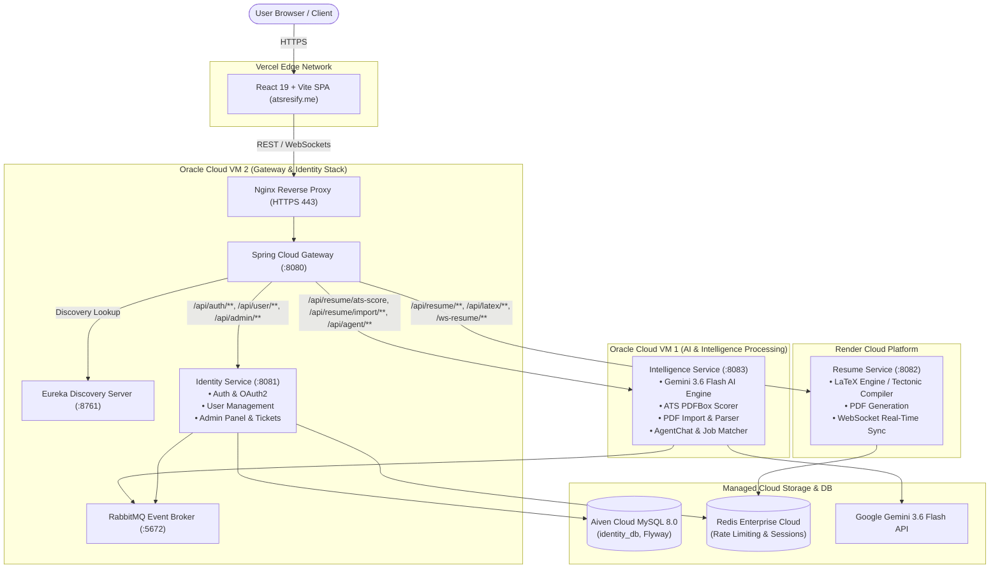

# 🚀 ATS Resify - AI-Powered LaTeX Resume Builder & ATS Intelligence Platform

[](https://www.oracle.com/java/)
[](https://spring.io/projects/spring-boot)
[](https://spring.io/projects/spring-cloud)
[](https://react.dev/)
[](https://vitejs.dev/)
[](https://tailwindcss.com/)
[](https://deepmind.google/technologies/gemini/)
[](https://www.docker.com/)
[](https://atsresify.me)

> **ATS Resify** is a production-grade, microservice-architected web platform that generates professional, high-scoring resumes designed specifically to bypass Applicant Tracking Systems (ATS). By combining plain-English AI generation via **Google Gemini 3.6 Flash** with compile-ready **LaTeX templates**, ATS Resify guarantees structurally flawless PDF resumes alongside real-time scoring, PDF parsing, job description matching, and interactive AI editing.

---

## 🌐 Live Production Application
- **Frontend App**: [https://atsresify.me](https://atsresify.me)
- **API Gateway**: `https://api.atsresify.me` (or direct backend routes via VM2)

---

## 🎯 Key Features & Capabilities

### 🤖 1. AI-Driven Resume Generation (Google Gemini 3.6 Flash)
- **Plain English to LaTeX**: Converts simple user inputs (e.g., *"I built a website for my client using React"*) into impact-driven, quantifiable resume bullet points (*"Engineered a high-performance web application using React, boosting page load speeds by 40%..."*).
- **LangChain4j & RestClient Integration**: High-throughput AI prompt execution tuned specifically to output strict, valid LaTeX code without breaking compilation.

### 📄 2. Real-Time LaTeX Engine & Live PDF Preview
- **Monaco Editor Integration**: Embedded side-by-side Monaco editor with syntax highlighting, auto-compilation, auto-saving, and live PDF rendering (`react-pdf`).
- **4+ Standard LaTeX Templates**: Includes Modern, Minimalist, Classic, and Creative styles.
- **Tectonic / MiKTeX Compiler**: Direct backend LaTeX compilation producing razor-sharp, text-selectable, ATS-readable PDFs.
- **Version History & Real-Time Sync**: Snapshot history with instant restoration and WebSocket synchronization (`/ws-resume`).

### 📊 3. ATS Scoring & Deep Keyword Analytics
- **Apache PDFBox Extraction**: Parses compiled or uploaded PDFs into raw, unstructured text.
- **Keyword & Structural Scoring Engine**: Scores resumes on keyword density, section headers, formatting safety, and action-verb frequency.
- **Actionable Optimization Reports**: Highlights missing high-value keywords, formatting flags, and structural recommendations.

### 📥 4. AI PDF/DOCX Resume Importer & Semantic Parsing
- **PDF Resume Import**: Upload existing resumes in PDF or DOCX format.
- **Semantic Data Extraction**: AI parses unstructured documents into structured JSON objects (Education, Work Experience, Skills, Projects, Certifications) and populates the editor instantly.

### 💬 5. Conversational AI Resume Assistant (`AgentChat`)
- **Interactive Contextual Chat**: In-editor AI assistant trained on resume best practices.
- **Instant Section Tailoring**: Prompt the agent to rewrite summary statements, expand experience sections, or add targeted technical skills on the fly.

### 🎯 6. Job Description Matcher (`JobMatch` & `QuickScore`)
- **Targeted Matching**: Compare your resume directly against any job description.
- **Fit Percentage & Gap Analysis**: Receive instant fit scores, identified skill gaps, and custom tailoring advice to maximize interview callback rates.

### 🛡️ 7. Admin Command Center & Security
- **Google OAuth2 & JWT Authentication**: Secure sign-in with Google OAuth2, issuing short-lived, stateless JWT tokens for role-based authorization (`USER`, `ADMIN`).
- **Admin Dashboard (`AdminPanel`)**: Real-time admin control panel for monitoring active users, support tickets, system logs, telemetry, and AI token usage.

---

## 🏗️ System Architecture

ATS Resify is structured as a **decoupled, multi-service architecture** distributed across cloud environments for high availability and zero operational costs.



---

## 🧱 Microservices & Service Ownership

| Service Name | Port | Primary Responsibilities | Key API Route Prefixes | Owned Data / Schema |
| :--- | :---: | :--- | :--- | :--- |
| **`gateway-service`** | `8080` | Dynamic route proxying, CORS policy enforcement, rate limiting, request correlation IDs, JWT verification filter. | `/**` | N/A (Stateless) |
| **`discovery-server`** | `8761` | Netflix Eureka service registration, heartbeats, and dynamic service discovery. | `/eureka/**` | In-Memory Registry |
| **`identity-service`** | `8081` | Google OAuth2 flow, JWT issuance, user profile management, admin command center, support/feedback tickets, Flyway database migrations. | `/oauth2/**`, `/api/auth/**`, `/api/user/**`, `/api/admin/**`, `/api/public/**` | `users`, `roles`, `feedback`, `audit_logs` (`identity_db`) |
| **`resume-service`** | `8082` | Resume CRUD operations, LaTeX code compilation (MiKTeX/Tectonic), PDF rendering, template catalog, version snapshots, WebSocket synchronization. | `/api/resume/**`, `/api/latex/**`, `/api/resume-sync/**`, `/ws-resume/**` | `resumes`, `resume_snapshots`, `templates` |
| **`intelligence-service`** | `8083` | Gemini 3.6 Flash AI execution, ATS PDFBox text extraction & scoring engine, PDF resume importer, AgentChat conversational assistant, job description matching. | `/api/resume/ats-score`, `/api/resume/import/**`, `/api/agent/**`, `/api/job-match/**` | `ats_reports`, `ai_conversations`, `usage_accounting` |
| **`common-lib`** | N/A | Shared Maven library containing JWT security primitives, common DTOs, global exception handlers, and infrastructure utility classes. | N/A | Shared Java Classes |

---

## 🗺️ Cloud Infrastructure & Deployment Topology

| Machine / Platform | IP / Host Domain | Hosted Services | Deployed Stack File |
| :--- | :--- | :--- | :--- |
| **Oracle Cloud VM 1** | Oracle Cloud | `intelligence-service` | `docker-compose.vm1.yml` |
| **Oracle Cloud VM 2** | Oracle Cloud | `discovery-server`, `gateway-service`, `identity-service`, `rabbitmq`, Nginx | `docker-compose.vm2.yml` / `docker-compose.single-vm.yml` |
| **Render Cloud** | `resify-resume-service.onrender.com` | `resume-service` (LaTeX Compiler Engine) | Docker deployment hook via Render |
| **Vercel Network** | `atsresify.me` / `www.atsresify.me` | Single Page Application (React 19 / Vite) | Automatic deployment via Git push |
| **Aiven Cloud** | Cloud MySQL 8.0 Cluster | `identity_db` relational database | TLS Connection (`3306`) |
| **Redis Cloud** | Redis Enterprise Cloud | Session cache & API Gateway rate limiting | TLS Connection (`19810`) |

---

## 💻 Tech Stack

### 🔹 Backend
- **Framework**: Java 21, Spring Boot `3.5.15`, Spring Cloud `2025.0.3`
- **Security**: Spring Security, OAuth2 Client, JJWT (`0.12.3`)
- **Service Discovery & Gateway**: Netflix Eureka Server, Spring Cloud Gateway
- **AI Engine**: Google Gemini 3.6 Flash API via **LangChain4j** (`0.35.0`) & Spring `RestClient`
- **PDF & Document Engine**: Apache PDFBox (`2.0.27`), MiKTeX / pdflatex / Tectonic
- **Database & Migration**: Aiven Cloud MySQL 8.0, Hibernate/JPA, Flyway DB (`src/main/resources/db/migration/`)
- **Messaging & Cache**: RabbitMQ, Redis Enterprise Cloud

### 🔹 Frontend
- **Framework & Build**: React `19.1.1`, Vite (with Rolldown engine), JavaScript (ESNext)
- **Styling & Components**: Tailwind CSS `v4`, Ant Design (antd `5.27`), Material UI (MUI `v7`), Framer Motion, GSAP
- **Code Editor**: `@monaco-editor/react` (Monaco Editor for live LaTeX editing)
- **PDF Viewer & Canvas**: `react-pdf`, `html2pdf.js`, `jspdf`
- **Icons & Visuals**: Lucide React (`lucide-react`), `@ant-design/icons`, `@mui/icons-material`
- **Analytics & Telemetry**: PostHog (`posthog-js`), Sentry (`@sentry/react`), Vercel Speed Insights

---

## 📂 Project Directory Structure

```text
AI_Resume_Builder_Backend/
├── ARCHITECTURE.md              # Microservice domain boundary decision log
├── CODE_REVIEW.md                # Codebase audit & security recommendations
├── DEPLOYMENT_MASTER_MANUAL.md   # Production VM deployment manual
├── docker-compose.yml            # Local development Docker Compose file
├── docker-compose.vm1.yml        # VM1 Intelligence service deployment compose
├── docker-compose.vm2.yml        # VM2 Infrastructure stack deployment compose
├── docker-compose.single-vm.yml  # All-in-one single VM deployment compose
│
├── Backend/                      # Java Spring Boot Microservices Monorepo
│   ├── pom.xml                   # Maven Parent Reactor POM (Java 21 / Spring Boot 3.5)
│   ├── common-lib/               # Shared security, DTO, and exception classes
│   ├── discovery-server/         # Eureka Discovery Server (:8761)
│   ├── gateway-service/          # Spring Cloud API Gateway (:8080)
│   ├── identity-service/         # Identity, User Management, OAuth2 & Admin (:8081)
│   ├── resume-service/           # Resume CRUD & LaTeX PDF Compiler (:8082)
│   └── intelligence-service/     # Gemini AI Engine & ATS PDFBox Scorer (:8083)
│
└── FrontEnd/
    └── frontend/                 # React 19 + Vite Single Page Application
        ├── index.html            # Entry HTML template
        ├── package.json          # Node dependencies & Vite scripts
        └── src/
            ├── components/       # Reusable components (AgentChat, LatexEditor, ResumeSyncEditor, etc.)
            ├── pages/            # Page routes (LandingPage, EditResume, AtsChecker, AdminPanel, JobMatch)
            ├── services/         # Axios API clients & gateway connectors
            └── utils/            # Helper utilities and token handlers
```

---

## 🛠️ Local Development & Setup Guide

### Prerequisites
Make sure you have the following installed locally:
- **Java 21 JDK**
- **Node.js 18+** & **npm**
- **MySQL 8.0** (or Docker container)
- **Redis** (optional for local, required for rate limiting)
- **MiKTeX / pdflatex** (Ensure `pdflatex` is added to your system `PATH`)
- **Google Gemini API Key** (Set `GEMINI_API_KEY` in environment variables)

---

### Step 1: Clone & Environment Setup

```bash
git clone https://github.com/praveensuthar2105/ATS_Resify.git
cd ATS_Resify
```

Create a `.env` file in the root directory or inside `Backend/`:
```env
SPRING_DATASOURCE_URL=jdbc:mysql://localhost:3306/identity_db?createDatabaseIfNotExist=true
SPRING_DATASOURCE_USERNAME=root
SPRING_DATASOURCE_PASSWORD=yourpassword

SPRING_REDIS_HOST=localhost
SPRING_REDIS_PORT=6379

GEMINI_API_KEY=your_google_gemini_api_key
JWT_SECRET=your_super_secret_jwt_signing_key_min_256_bits
```

---

### Step 2: Build & Run Backend Microservices

#### Option A: Running with Maven (Local Development)

1. **Build the full Maven Reactor**:
   ```bash
   cd Backend
   ./mvnw clean install -DskipTests
   ```

2. **Start services individually in separate terminals**:
   ```bash
   # Terminal 1: Discovery Server
   ./mvnw -pl discovery-server spring-boot:run

   # Terminal 2: Identity Service
   ./mvnw -pl identity-service spring-boot:run

   # Terminal 3: Resume Service
   ./mvnw -pl resume-service spring-boot:run

   # Terminal 4: Intelligence Service
   ./mvnw -pl intelligence-service spring-boot:run

   # Terminal 5: API Gateway
   ./mvnw -pl gateway-service spring-boot:run
   ```

#### Option B: Running via Docker Compose

To spin up the local development stack:
```bash
docker compose up -d --build
```

---

### Step 3: Run Frontend Application

1. **Navigate to the frontend directory**:
   ```bash
   cd FrontEnd/frontend
   ```

2. **Install dependencies**:
   ```bash
   npm install
   ```

3. **Start Vite Development Server**:
   ```bash
   npm run dev
   ```

4. Open your browser at `http://localhost:5173`.

---

## 🚢 Deployment & CI/CD Pipeline

Production deployment is automated via **GitHub Actions** workflows (`.github/workflows/`):

1. **Git Push to `main`**:
   - Triggers `vm-cd.yml` which SSHs into VM 1 and VM 2, pulls the latest code, compiles Maven JARs, and runs `docker compose -f docker-compose.vm*.yml up -d --build`.
   - Triggers Render deploy hook for `resume-service`.
   - Vercel automatically builds and deploys the React 19 frontend to `https://atsresify.me`.

Refer to [DEPLOYMENT_MASTER_MANUAL.md](DEPLOYMENT_MASTER_MANUAL.md) for full instructions on manual VM deployment and troubleshooting.

---

## 📄 License & Credits

- Developed by **[Praveen Suthar](https://github.com/praveensuthar2105)**
- Designed & Architected for ATS Compliance and High-Performance Resume Generation.
